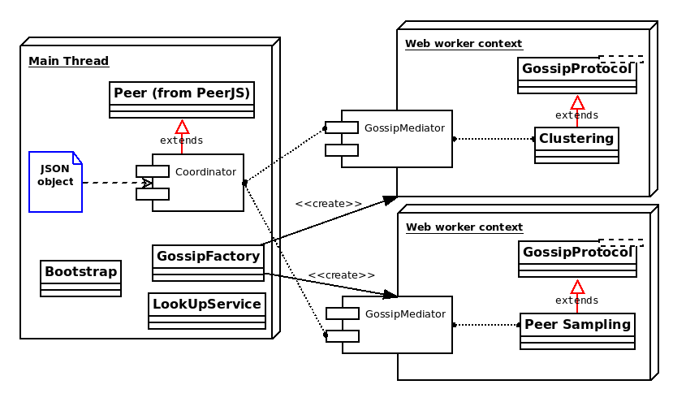
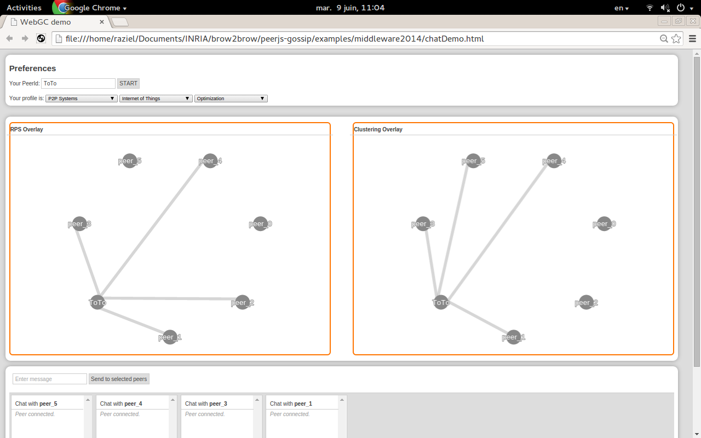

# WebGC: Web Gossip Communication
WebGC is a Peer-to-Peer (P2P) library to coordinate the execution of gossip protocols, e. i. a gossip-based library. This project uses [WebRTC](http://www.webrtc.org/) to communicate web browsers with each other and depends of [simple-peer](https://github.com/feross/simple-peer) that provides a P2P communication API (WebRTC wrappers, message serialization, send and receive primitives, etc.) to exchange data over the Internet. WebGC offers a catalog of gossip protocols which is maintain by the library, users can extend this catalog via the implementation of just one interface.

## Architecture

The last figure shows an overview of the WebGC architecture. Firstly, this library receives as input one configuration file (JSON object) to specify the protocols that will run on your web browser. Shortly afterwards, the ```GossipFactory``` creates one [Web Worker](http://www.w3schools.com/html/html5_webworkers.asp) and two main objects in the context of the worker: i) one gossip protocol defined in the configuration file and ii) one ```GossipMediator``` to exchange messages with the main thread of JavaScript; users can easily enrich WebGC with more protocols via the implementation of the ```GossipProtocol``` interface. Finally two additional services are provided: in one hand, the ```Bootstrap``` service allows peers to be included in the P2P overlay in case of having any peer on-line, in the other hand the ```LookupService``` replace the [brokering server](https://github.com/peers/peerjs-server) which it is used by PeerJS as intermediary to set WebRTC data connections between two peers.


# Installation instructions
WebGC is a front-end library but in order to execute all the examples in this repository, it is required to have the next programs installed: [NodeJS](http://nodejs.org/) (node is used generally in back-end applications and it is required for bootstrapping the communication with peers in PeerJS), [Bower](http://bower.io/), [NPM](https://www.npmjs.org/), the scripts of the examples requires Chrome (31 or higher) but WebGC is compatible with Firefox too, furthermore, peers running on Chrome can reach others running Firefox. Once you are done with the last requirements, do as follows:

- type ``` bower install ``` in the main directory

Now you are done with the front-end part; additionally you must clone the PeerJS-Server Gossip project as follows:

- Clone PeerJS-Server Gossip typing: ``` git clone               
  git+ssh://<user>@scm.gforge.inria.fr//gitroot/serverjs-gossip/serverjs-gossip.git  ```
  the ``` <user> ``` tag must be replaced with your user's name
- Type ```npm install``` in the main directory
- That's it, refer to the ```README.md ``` file for more information about the project and why WebGC needs it

# Examples
There is one example that coordinates the execution of two gossip protocols, Random Peer Sampling (RPS) and clustering protocol, to discover peers with similar profiles. This example was presented in [Middleware 2014](http://2014.middleware-conference.org/program/posters/) in the session of demos and posters, for more information about this example refer to the file ```examples/middleware2014/README.md```, and its execution is done via the script ```examples/middleware2014/launch.sh``` that accepts three parameters  ```<peers>, <execution-time>, <serverjs-gossip-dir> and <peer-profile>``` where:

- ```<peers>``` is the number of peers in the test (integer),
- ```<execution-time>``` is the duration (in minutes) of the test (integer) and
- ```<serverjs-gossip-dir>``` is the directory where you clone the ServerJS-Gossip project
- ```<peer-profile>``` integer with two possible values: 1 or 2. This value refers to the files ```examples/middleware2014/preferences1``` or ```examples/middleware2014/preferences2``` respectively, where you are going to find a list of topics in computer sciences; each peer profile is made of one or two list of subjects chosen in a randomly way from the files of preferences

## Script execution
Type:

- ```cd <PATH>/peerjs-gossip/examples/middleware2014```
    - Where ```<PATH>``` is the directory that contains both projects, PeerJS-Gossip and
    ServerJS-Gossip.

- ```./launch.sh 10 5 <PATH>/serverjs-gossip 1```

whit the last execution seven windows of Chrome are going to appear during five minutes. In the interface of six peers (named by Peer_[1,2,...,6]) you are going to see just the peers' profile and one table with statistics about to which extend the gossip protocol evolves. There is just one peer that is going to show the gossip overlays as it is shown in the next picture:



That is your peer! please, type your name and after choosing the subjects in your profile click on the ```START``` button. After a couple of seconds (time to perform one gossip cycle) you are going to see two graphs that represents the RPS and Clustering overlay, respectively; due to the iterative nature of gossiping the connections on each graph are going to change continuously. Moreover, on the bottom of the web page there is the chat section where basically you can select one chat box, type a message on the text box and click on the ```SEND``` button to exchange message with the connections you have on the clustering overlay.

If you want to see a better interaction with another peer, do as follows: i) open another tab and copy/paste the link of the ```chatDemo.html``` page, ii) in the new tab type another peer name, chose the same profile that you used before and click on the ```START``` button, finally iii) as soon as you have a connection with the new peer in any of the two clustering overlays, you can exchange messages between the two clients with interfaces


# Documentation
You can find the documentation of each object in this library at the ```doc ``` folder

## About the doc
This project uses [JSDoc](https://github.com/jsdoc3/jsdoc) to create the documentation of the code
at the ```src``` directory. In order to generate a new documentation you must install JSDoc
through [Bower](http://bower.io/). **NOTE** dependencies for development are written in the file
```bower.json``` and there is one [Grunt](http://gruntjs.com/) task  for the generation doct at ```Gruntfile.js```

#Compatibility
This project is compatible with Linux based systems (tested in Ubuntu 14.10) and MacOS (OS X Yosemite version 10.10), the web browser Chrome (version 38 or higher) must be installed too. Do not hesitate to report any issue or comment with the project.

#TODO
- Take rid off PeerJS
- Launch WebGC on NodeJS
- <s>Take rid off the signaling server</s>